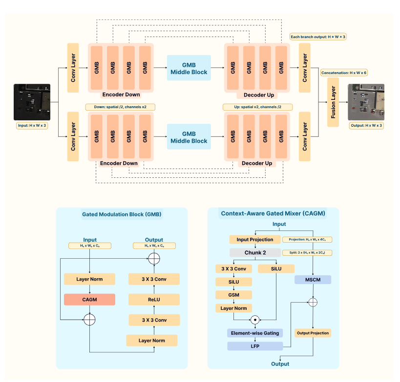
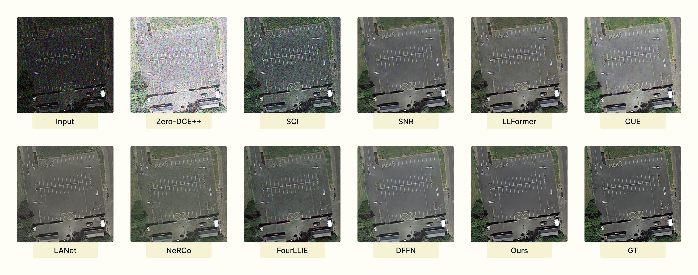
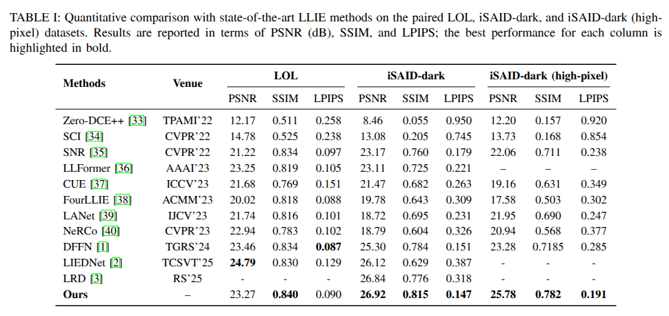

# DG-GSM: Dual-Branch Gated Selective Modulation Network for Nighttime Remote Sensing Image Enhancement and Detection

Official PyTorch implementation of **DG-GSM**, a dual-branch encoder-decoder
framework for nighttime remote sensing image enhancement and downstream
object detection.

---

## 🔥 Overview

Low-light and nighttime remote sensing images often suffer from severe underexposure,
strong noise, low contrast, and color distortion, which significantly degrade both
visual quality and downstream vision tasks (e.g., object detection).

**DG-GSM** addresses these challenges through:

- **Dual-Branch U-Net Architecture**
  with separately parameterized branches and learned 1×1 feature fusion.

- **Gated Modulation Blocks (GMBs)**
  containing a Context-Aware Gated Mixer (CAGM), Gated Selective
  Modulation (GSM), Learned Feature Projection (LFP), and MSCM.

- **Fully Parallel Gated Selective Modulation**
  providing content-adaptive feature modulation without recurrence or scanning.

- **Night Illumination Restoration Loss (NIRL)**
  combining pixel-wise, VGG perceptual, and focal-frequency terms.

---

## 🧠 Architecture & Visual Results

  
**Figure 1:** Overall architecture of the proposed DG-GSM framework.

  
**Figure 2:** Qualitative comparisons on low-light remote sensing images.

  
**Figure 3:** Quantitative performance comparison.

---

## 📦 Datasets

DG-GSM is evaluated on both **paired (reference-based)** and
**unpaired (no-reference)** low-light datasets, following the experimental setup
used in the paper.

### 🔹 Paired / Supervised Datasets

- **LOL Dataset (paired)**  
  https://drive.google.com/file/d/1L-kqSQyrmMueBh_ziWoPFhfsAh50h20H/view

- **iSAID-dark Dataset (paired, remote sensing)**  
  https://drive.google.com/file/d/1mlTTdbqG1ZheaWsBcIjAKDyCdbuAqpvy/view

### 🔹 Unpaired / No-Reference Datasets

- **darkrs Dataset (real nighttime remote sensing)**  
  https://drive.google.com/file/d/1XQGpzB9vDGkO7ULnGOF86cyZdqtrX4tI/view

- **ExDark Dataset (natural images)**  
  https://github.com/cs-chan/Exclusively-Dark-Image-Dataset

> **Evaluation Notes**
> - Paired datasets: **PSNR ↑ / SSIM ↑ / LPIPS ↓**
> - Unpaired datasets: **NIQE ↓** + qualitative comparison

---

## 📊 Results and Outputs

We provide comprehensive qualitative and quantitative results for both
paired and unpaired datasets to demonstrate the robustness and generalization
capability of **DG-GSM**.

---

## 🔹 Paired Datasets (Reference-Based Evaluation)

### 📁 Datasets
- **iSAID-dark**
- **iSAID-dark (high-pixel resolution)**

### 📥 Results Download Links

| Dataset | Resolution | Results |
|------|------------|--------|
| iSAID-dark | Standard | 🔗 [Download](https://drive.google.com/drive/folders/1oh_hp_s5YUnyiYvtkP7ewxE422Z0mKs3?usp=sharing) |
| iSAID-dark (High-Pixel) | High | 🔗 [Download](https://drive.google.com/drive/folders/1acF9DR0vrX2WoR2q-NtjHSd453XfR4cv?usp=sharing) |

---

## 🔹 Unpaired Datasets (No-Reference Evaluation)

### 📁 Datasets
- darkrs
- LIME
- NPE
- DICM

### 📥 Results Download Links

| Dataset | Results |
|------|--------|
| darkrs | 🔗 [Download](https://drive.google.com/file/d/1Xu9_3nT6ZbLd6cIXgo4PnmVdqIUU4-Oe/view?usp=sharing) |
| LIME | 🔗 [Download](https://drive.google.com/file/d/1U93HRF4LdPdHVV_Coo1lyay9E-u5bjvO/view?usp=sharing) |
| NPE | 🔗 [Download](https://drive.google.com/file/d/1YoVyZfW9RauM0RgQ3sqLYhcT-Q8AfTqn/view?usp=sharing) |
| DICM | 🔗 [Download](https://drive.google.com/file/d/1wiPme_xc-JVQqCuh2_EqgPe4zyMQgQcf/view?usp=sharing) |

---

## 🎯 Downstream Task: Object Detection with YOLOv12

To verify that enhancement improves **practical vision tasks**, we evaluate
object detection performance using **YOLOv12** on three image versions:

- **Night**: original low-light images
- **DG-GSM**: enhanced images
- **GT**: ground-truth / well-lit images

### 📥 YOLOv12 Detection Results

| Version | Description | Link |
|------|------------|------|
| Night | Original low-light images | 🔗 [Download](https://drive.google.com/drive/folders/1xkfBDKB98xEC-OqCcYb9FkecpU3hk-0B?usp=sharing) |
| DG-GSM | Enhanced images | 🔗 [Download](https://drive.google.com/drive/folders/17Fm9HbNcQAoLuA6q77yoywIZ2JZ_Fi2B?usp=sharing) |
| GT | Reference images | 🔗 [Download](https://drive.google.com/drive/folders/1rN2NNkRWmUnSe-317lIy8w1kYK3pZ7wb?usp=sharing) |

---

## 🗂️ Repository Structure

```text
DG-GSM/
├── checkpoints/            # empty (saved checkpoints)
├── configs/                # training / evaluation configs
├── data/                   # dataset loaders (no raw data)
├── figures/                # paper figures
├── losses/                 # loss functions
├── models/                 # DG-GSM architecture
├── results/                # empty (output placeholders)
├── utils/                  # metrics and helpers
├── weights/                # empty (pretrained models)
├── train.py
├── evaluate.py
├── test.py
├── requirements.txt
└── README.md

```
---
## ⚙️ Installation
```
git clone https://github.com/AnasHXH/DG-GSM.git
cd DG-GSM

python -m venv .venv
source .venv/bin/activate
pip install -r requirements.txt

```
---
## 📁 Data Preparation (Recommended Format)

1) Paired datasets (LOL / iSAID-dark)
   Use the following layout:
```text
   data/LOL/
├── train/
│   ├── low/
│   └── high/
└── test/
    ├── low/
    └── high/
   ```
  ```text
data/iSAID-dark/
├── train/
│   ├── low/
│   └── high/
└── val/
    ├── low/
    └── high/

```
Update your config paths in configs/*.yaml accordingly.
---
## 🚀 Training
  ```
python train.py --config configs/config.yaml

  ```
Common options you may expose (depending on your code):
  ```
--config
--device cuda
--batch_size 4
--epochs 500
--lr 2e-4
  ```
---
## 🖼️ Inference (Single Folder)
  ```
python test.py \
  --ckpt checkpoints/best_model_psnr.pth \
  --input_dir path/to/low_light_images \
  --output_dir outputs/

  ```
---
## ✅ Evaluation (Paired: PSNR/SSIM/LPIPS)
  ```
python evaluate.py \
  --config configs/eval_isaid_dark.yaml

  ```
---


## 📌 Citation
If you use this work, please cite:
  ```
@article{ali_DGGSM_2026,
  title   = {DG-GSM: Dual-Branch Gated Selective Modulation Network for Low-Light Remote Sensing Image Enhancement},
  author  = {Ali, Anas M. and Benjdira, Bilel and Aloqayli, Hamad and Othman, Esam and Boulila, Wadii},
  journal = {Under Review},
  year    = {2026}
}

  ```
---

